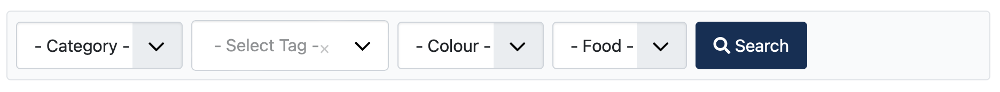

# FilterMagic

Add custom filters to your Joomla categories



## Overview

FilterMagic lets you add the following kinds of filters for each category displayed in the frontend of your site:

* **Subcategory**. Display articles which belong in one or more selected subcategories. Useful for Blog views and derivatives.
* **Tag**. Display articles which are tagged with one or more of the selected tags.
* **Custom fields**. Display articles whose custom field matches the filter selection.

Limitation: Custom field filters only perform exact matching, i.e. you cannot do a partial search. As a result it is strongly recommended to only use it with list, radio, SQL custom field types and similar.

You can filter by custom fields located in subform fields. In this case, an article will be displayed if _any_ of the subform rows matches the custom field filtering criteria.

Filters are defined as standard Joomla XML form files.

## Use cases

Sites with resource directories implemented with Joomla content and custom fields. Instead of just listing all resources and let the user figure it out you can let them dynamically filter based on subcategories, tags, and custom field values to narrow down their search.

Simple stores based on Joomla content, custom fields, and 3PD extensions such as J2Store. Instead of a litany of menu items you can have dynamic filtering of the products (articles) so the user can find what they need, faster and easier.

## Usage

### Location of filter files

You need to create a file named `filter_123.xml` where `123` is the category ID you need to filter. Your frontend menu item MUST use one of the category article list views (Article List or Blog View) with this specific category selected.

The file can be placed in either of the following locations:

- templates/YOURTEMPLATE/filters
- plugins/system/filtermagic/filters

The former (template path) has precedence, i.e. it will override a filter file placed in the plugin's folder. This allows you to have per-template filters.

### Format of filter files

A filter file is a standard Joomla XML form file with the filters inside the `<fields name="filter">` fields container in the form.

```xml
<?xml version="1.0" encoding="utf-8"?>
<form addfieldprefix="Dionysopoulos\Plugin\System\FilterMagic\Field">
    <fields name="filter">
        <field
                name="catid"
                type="subcategory"
                label="JCATEGORY"
                hint="JOPTION_SELECT_CATEGORY"
                published="1"
                language="*"
                root="123"
        />

        <field
                name="tag"
                type="tags"
                label="JTAG"
                hint="JOPTION_SELECT_TAG"
                multiple="false"
                mode="nested"
                custom="false"
        >
            <option value="">JOPTION_SELECT_TAG</option>
        </field>

        <field
                name="colour"
                type="custom"
                customfield="1"
                default=""
                class=""
                layout="joomla.form.field.list"
        >
            <option value="">- Colour -</option>
        </field>

        <field
                name="fishormeat"
                type="custom"
                customfield="1"
                default=""
                class=""
                layout="joomla.form.field.list"
        >
            <option value="">- Food -</option>
        </field>
    </fields>
</form>
```

### Subcategory filter

It filters articles by their subcategory.

The `<form>` tag **MUST** have the `addfieldprefix="Dionysopoulos\Plugin\System\FilterMagic\Field"` attribute if you are using a subcategory filter.

The subcategory filter MUST be named `catid` and has the following definition
```xml
<field
        name="catid"
        type="subcategory"
        label="JCATEGORY"
        hint="JOPTION_SELECT_CATEGORY"
        root="123"
        published="1"
        language="*"
        multiple="false"
/>
```

The attributes you can / should modify are:

* **`root`** You **MUST** set this to the category ID of your frontend menu item to only show its subcategories instead of all categories known to Joomla.
* **`published`** A comma-separated list of publish statuses for categories you want to make available for selection. It is recommended to set this to `published="1"`, i.e. only allow published categories to be displayed.
* **`language`** A comma-separated list of languages to filter categories by. By default, `*` is applied (all languages).
* **`multiple`** Use `multiple="1"` to allow multipled subcategories to be selected.

Subcategories are automatically filtered by viewing access level, i.e. the user will not see any subcategories listed if they are not allowed to view them.

An empty selection with the (translated) label `JOPTION_SELECT_CATEGORY` is always added, so your users can de-select the filter.

### Tag filter

It filters articles by their assigned tags.

The `<form>` tag **MUST** have the `addfieldprefix="Dionysopoulos\Plugin\System\FilterMagic\Field"` attribute if you are using a tags filter.

The tag filter MUST be named `tag` and has the following definition:

```xml
<field
        name="tag"
        type="tags"
        label="JTAG"
        hint="JOPTION_SELECT_TAG"
        multiple="false"
        mode="nested"
        custom="false"
>
    <option value="">JOPTION_SELECT_TAG</option>
</field>
```

You MUST include the `<option>` as shown above to be able to de-select this filter.

Set `multiple="true"` to allow multiple tags to be selected.

There is an optional attribute called `root`. If you only want to display tags nested under a specific tag, enter the tag's ID as its value. For example, to only display tags under the tag with ID 123 (but **NOT** tag 123), add `root="123"` to your field.

### Custom field filter

It filters article by the value of a custom field.

It has the following definition:

```xml
<field
        name="colour"
        type="custom"
        customfield="1"
        default=""
        class=""
        layout="joomla.form.field.list"
>
    <option value="">- Colour -</option>
</field>
```

Attributes:

* `name` This must be the same as the name (NOT label!) of your custom field.
* `type` This is ignored, but must be present for Joomla to parse the form file. Just use `type="custom"`.
* `customfield` This MUST be present and set to 1: `customfield="1"`. It tells FilterMagic that this is a custom field filter.

Everything else is passed as-is to the filter form.

Joomla's List and Radio fields use a toggle button selection by default which may be nice for the backend, where you select the field's value, but not so nice for the frontend filter form. To avoid this display form set `class="" layout="joomla.form.field.list"` to render the filter as a drop-down list. You can, of course, use your own class and/or layout if you want.

Joomla's custom fields always have a default value. If this is anything other than an empty string your filter will be impossible to unset. To avoid this problem set `default=""` and add the `<option>` tag as shown above. The `value` attribute of the `<option>` tag must be empty, as shown. The content (what is displayed ot the user) can be any text or language key.

#### Subform fields

You can filter articles by the value of a _subform_ field. The `name` attribute of your filter is the name (NOT label!) of the subform field.

The caveat is how the matching is done in this case. An article which has one or more subform rows (of _any_ subform!) with this specific field value will be displayed. If you have two or more subforms using the same field you may get results that you wouldn't expect. Don't do that! It's asking for trouble.

#### Supported field types

Custom field filters only match **exact** values. There is no support for partial text search. As a result we only recommend using these filters with filter types which operate against a set of predefined values such as List, Radio, and SQL.

While you _can_ define filters against Text and similar fields (e.g. URL, Email, …) this is considered to be a bad idea because the interface will confuse the user: they will be expected to enter an _EXACT_ match (capital letters, whitespace, punctuation and all) to the contents of a text field. As a result we recommend **AGAINST** doing that.

Using other field types with complex interfaces, such as maps and editors, is very likely to not work and confuse your users. You have been warned.

#### How does this work?

We call the same Joomla custom fields plugin events used when rendering the backend interface for entering the value of a custom field when editing an article. These plugins essentially define an XML form field. We transplant this XML form field definition in the filter form, adding the attributes and options defined in _your_ form to what the plugin returned. This makes the display of the filter fields completely agnostic to the form field type.

There are pros and cons to this approach. The obvious benefit is that we can support arbitrary custom field types which tend to extend from the standard List and Radio types but draw their options from a custom, often component-specific, source. The obvious downside is that the interface rendered for setting the value of a form field is not always suitable for filtering. That's why we only recommend using this with relatively simple fields which only render drop-down lists, radio/toggle buttons, and checkboxes.

## The frontend form

The filter form is rendered through the `onContentAfterTitle` event. As a result, it will appear below the category's title and above the category description. This is currently non-configurable.

The form rendering takes place through two Joomla layouts called `filtermagic.form` and `filtermagic.form.fields`. The former renders the outermost part of the forms and its submit button. The latter renders the individual fields. You can override these files in your template:

- templates/YOUR_TEMPLATE/html/layouts/filtermagic/form.php
- templates/YOUR_TEMPLATE/html/layouts/filtermagic/form/fields.php

You cannot have different filter layouts per category.

The form itself is very simple. It just POSTs to the current URL.

## Under the hood

Filter values are stored in the user session. Each category gets its own set of filter values storage. When the user logs out, or their session expires, filter values are reset. There is no provision for persisting filter preferences across logins. 